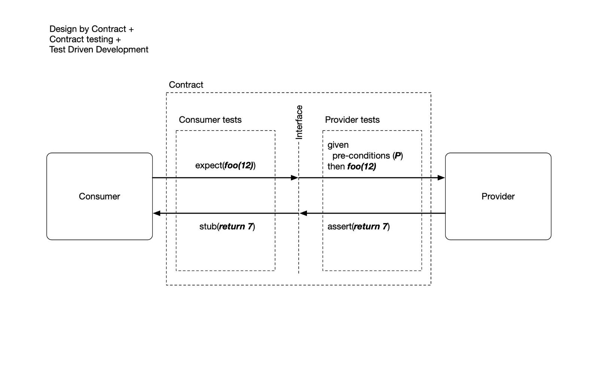

# TDD and Contract Testing

## Overview

This concerns the use of contract testing (incorporating the principles of Design by Contract) to mitigate the need for endless integration testing.

## Background

Influenced by this video by JS Rainsberger: https://www.youtube.com/watch?v=VDfX44fZoMc

## Hypothesis

Teams often use unit tests, integration tests, PACT contract tests and e2e tests in a big jumble without a coherent view on whether the whole system has effective coverage.

TDD is an excellent tool for building "units", "modules", however you want to describe these things. At some point, you will reach a boundary where you don't want to use a real object and you want to use some sort of test double.

We create mocks and stubs, often based on a class or interface. This makes client testing easy, but there is always the nagging feeling that you don't know if it will _really_ work when in production.

Using 'Design by Contract' principles to test the provider is one way that we might mitigate that feeling. It might provide confidence that the provider works in the way that the consumer expects it to.

If we can combine this with contract testing, similar to PACT, but not limited to HTTP/messaging, we could provide real confidence that components would work when integrated together. The expectations/stubs on the consumer would be backed up by tests against a real provider, together with preconditions to ensure the system is tested in the appropriate state. 

This doesn't, in and of itself, resolve the issue of incoherent system test coverage, but it might reduce the area of confusion.  
